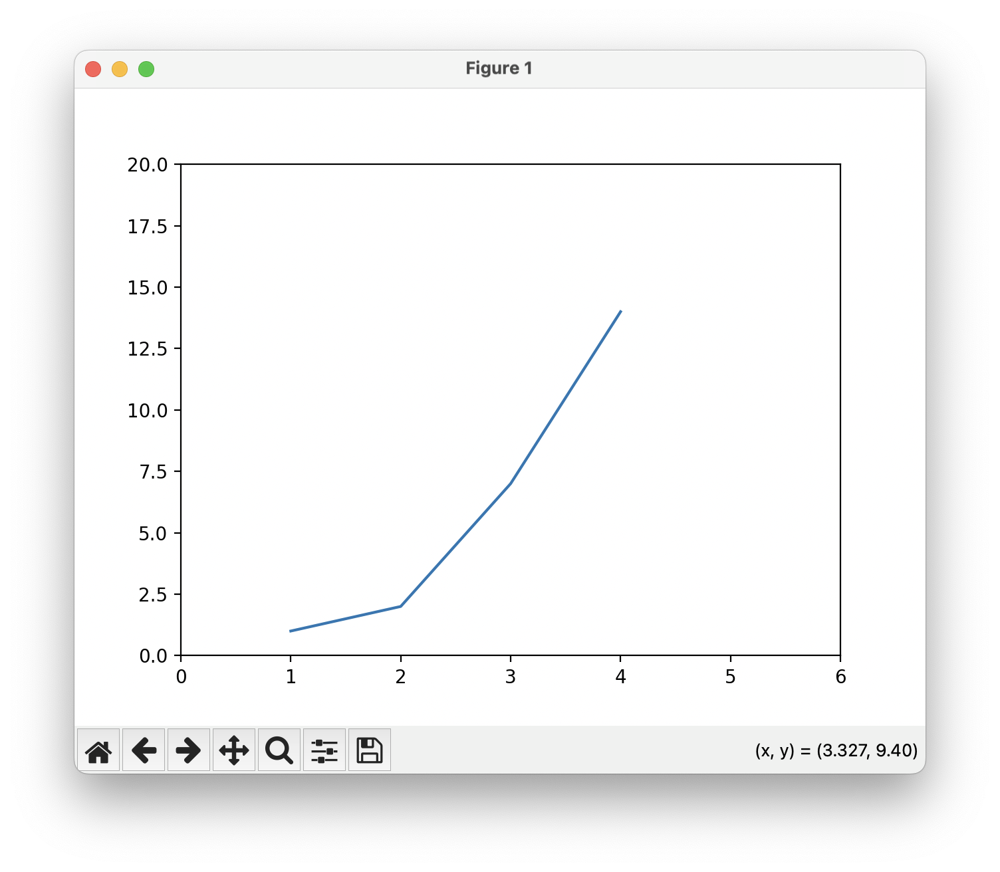
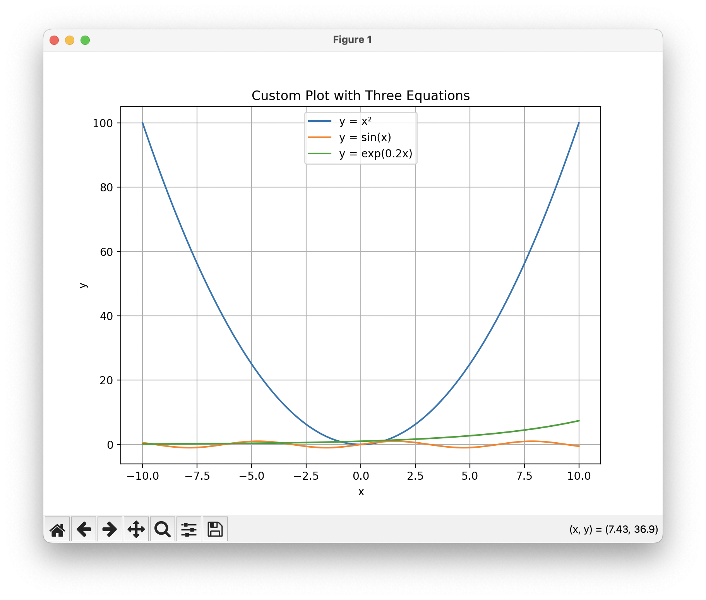

# ELEC 576 / COMP 576 – Assignment 0 (Fall 2025)
**Name:** Dev Sanghvi 
**NetID / Email:** ds221 / ds221@rice.edu

---

## 1. Python Machine Learning Stack (Anaconda)
**Task 1 – Paste `conda info`**


Here is the output of the following commands:

```
python --version
pip list
python -m site
python -m platform

```

Output:

```
apple@MacBook-Air-668 HW0 % python --version
Python 3.12.11
apple@MacBook-Air-668 HW0 % pip list
Package                   Version
------------------------- -----------
absl-py                   2.1.0
ace_tools                 0.0
altgraph                  0.17.4
anyio                     4.9.0
certifi                   2024.12.14
cffi                      1.17.1
charset-normalizer        3.4.0
click                     8.2.1
colorlog                  6.9.0
contourpy                 1.3.1
cryptography              45.0.7
cycler                    0.12.1
decompyle3                3.9.2
easydict                  1.13
et_xmlfile                2.0.0
fake-useragent            2.2.0
filelock                  3.16.1
fonttools                 4.55.3
fsspec                    2024.12.0
graphviz                  0.8.4
grpcio                    1.69.0
h11                       0.16.0
h2                        4.2.0
hf-xet                    1.0.2
hpack                     4.1.0
httpcore                  1.0.9
httpx                     0.28.1
huggingface-hub           0.27.0
hyperframe                6.1.0
idna                      3.10
imageio                   2.36.1
iniconfig                 2.0.0
Jinja2                    3.1.5
joblib                    1.4.2
kiwisolver                1.4.8
lazy_loader               0.4
libxml2-python            2.13.8
macholib                  1.16.3
Markdown                  3.7
markdown-it-py            3.0.0
MarkupSafe                3.0.2
matplotlib                3.10.0
mdurl                     0.1.2
menpo                     0.11.1
mpmath                    1.3.0
mxnet                     1.6.0
networkx                  3.4.2
numpy                     None
onnx                      1.17.0
onnxsim                   0.4.36
opencv-python             4.10.0.84
openpyxl                  3.1.5
packaging                 24.2
pandas                    2.2.3
pathlib2                  2.3.7.post1
pillow                    11.1.0
pip                       25.1.1
pluggy                    1.5.0
prettytable               3.12.0
protobuf                  5.29.2
pycparser                 2.22
pycryptodome              3.23.0
pydumpck                  1.20.1
Pygments                  2.19.0
pyinstaller               6.14.1
pyinstaller-hooks-contrib 2025.5
pyparsing                 3.2.1
pytest                    8.3.4
python-dateutil           2.9.0.post0
pytz                      2024.2
PyYAML                    6.0.2
redis                     6.2.0
regex                     2024.11.6
requests                  2.32.3
rich                      13.9.4
safetensors               0.5.0
scidatetime               1.20.5
scikit-image              0.25.0
scikit-learn              1.6.0
scipy                     1.15.0
setuptools                75.6.0
sgtpyutils                1.20.8
six                       1.17.0
sniffio                   1.3.1
spark-parser              1.8.9
sympy                     1.13.1
tensorboard               2.18.0
tensorboard-data-server   0.7.2
threadpoolctl             3.5.0
tifffile                  2024.12.12
timm                      1.0.12
tinyaes                   1.1.1
tokenizers                0.21.1
torch                     2.5.1
torchvision               0.20.1
tqdm                      4.67.1
transformers              4.50.0
typing_extensions         4.12.2
tzdata                    2024.2
uncompyle6                3.9.2
urllib3                   2.2.3
vastai                    0.2.8
wcwidth                   0.2.13
Werkzeug                  3.1.3
wheel                     0.45.1
xdis                      6.1.4
apple@MacBook-Air-668 HW0 % python -m site
sys.path = [
    '/Users/apple/Downloads/HW0',
    '/opt/homebrew/Cellar/python@3.12/3.12.11/Frameworks/Python.framework/Versions/3.12/lib/python312.zip',
    '/opt/homebrew/Cellar/python@3.12/3.12.11/Frameworks/Python.framework/Versions/3.12/lib/python3.12',
    '/opt/homebrew/Cellar/python@3.12/3.12.11/Frameworks/Python.framework/Versions/3.12/lib/python3.12/lib-dynload',
    '/opt/homebrew/lib/python3.12/site-packages',
    '/opt/homebrew/opt/python-tk@3.12/libexec',
    '/opt/homebrew/opt/python-gdbm@3.12/libexec',
    '/opt/homebrew/opt/python@3.12/Frameworks/Python.framework/Versions/3.12/lib/python3.12/site-packages',
]
USER_BASE: '/Users/apple/Library/Python/3.12' (doesn't exist)
USER_SITE: '/Users/apple/Library/Python/3.12/lib/python/site-packages' (doesn't exist)
ENABLE_USER_SITE: True
apple@MacBook-Air-668 HW0 % python -m platform
macOS-15.6.1-arm64-arm-64bit
apple@MacBook-Air-668 HW0 % 
```

---

## 2. IPython/Jupyter & MATLAB transition


**Task 2 – Linear Algebra Equivalents**  
Use any matrix/vector of your choice. Paste the commands you ran and the outputs.

**Your code (in a .py file or Jupyter notebook):**  
```python

import numpy as np
from numpy.random import default_rng
from scipy import linalg as la
from scipy import signal
from scipy.sparse import csc_matrix, diags
from scipy.sparse.linalg import eigs, cg

# ============================================================
# ELEC/COMP 576 – Task 2: MATLAB ↔ NumPy equivalents (ALL ITEMS)
# Polished formatting: clear headers, aligned labels, compact shapes.
# Paste outputs directly into your report.
# ============================================================

# ---- Pretty printing helpers -------------------------------------------------
np.set_printoptions(
    precision=4, suppress=True, linewidth=120, edgeitems=2, threshold=60
)

LINE = 80


def hdr(title: str) -> None:
    line = "=" * LINE
    print(f"\n{line}\n{title}\n{line}")


def sub(title: str) -> None:
    print(f"\n{title}\n" + "-" * len(title))


def kv(label: str, value, show_shape: bool = False) -> None:
    shape_str = ""
    if show_shape and hasattr(value, "shape"):
        shape_str = f"  (shape={tuple(value.shape)})"
    print(f"{label:<38} {value}{shape_str}")


def arr(label: str, value, show_shape: bool = True) -> None:
    shape_str = (
        f" (shape={tuple(value.shape)})"
        if show_shape and hasattr(value, "shape")
        else ""
    )
    print(f"{label}:{shape_str}\n{value}")


# ---- Baseline arrays ---------------------------------------------------------
hdr("Baseline arrays")
A = np.arange(1, 25 * 12 + 1).reshape(25, 12).astype(float)  # 25x12
v = np.linspace(0, 1, A.shape[1])  # length-12 mask for columns
v_col = v[:, None]  # (12,1)
kv("Array A: ", A)
kv("Array v: ", v)
kv("A.shape", A.shape)
kv("v.shape / v_col.shape", f"{v.shape} / {v_col.shape}")

# ---- Dimensions & sizes ------------------------------------------------------
hdr("Dimensions & sizes")
kv("ndims(A) = np.ndim(A) = A.ndim", f"{np.ndim(A)} = {A.ndim}")
kv("numel(A) = np.size(A) = A.size", f"{np.size(A)} = {A.size}")
kv("size(A) = np.shape(A) = A.shape", f"{np.shape(A)} = {A.shape}")
kv("size(A,1) → A.shape[0]", A.shape[0])
kv("size(A,2) → A.shape[1]", A.shape[1])

# ---- Array construction & blocks --------------------------------------------
hdr("Array construction & blocks")
arr("[1 2 3; 4 5 6]", np.array([[1.0, 2.0, 3.0], [4.0, 5.0, 6.0]]))
a = np.array([[1, 0], [0, 1]], float)
b = np.array([[2, 2], [2, 2]], float)
c = 3 * np.ones((2, 2))
d = np.eye(2) * 4
blk = np.block([[a, b], [c, d]])
kv("np.block([[a,b],[c,d]])", "constructed", show_shape=False)
kv("blk.shape", blk.shape)

# ---- Indexing & slicing ------------------------------------------------------
hdr("Indexing & slicing")
vec = np.arange(10)
kv("a(end) → vec[-1]", vec[-1])
kv("a(2,5) → A[1,4]", A[1, 4])
kv("a(2,:) → A[1,:]", A[1, :], show_shape=True)
kv("a(1:5,:) → A[:5,:]", A[:5, :], show_shape=True)
kv("a(end-4:end,:) → A[-5:,:]", A[-5:, :], show_shape=True)
kv("a(1:3,5:9) → A[0:3,4:9]", A[0:3, 4:9], show_shape=True)
kv("a([2,4,5],[1,3]) via ix_", A[np.ix_([1, 3, 4], [0, 2])], show_shape=True)
kv("a(3:2:21,:) → A[2:21:2,:]", A[2:21:2, :], show_shape=True)
kv("a(1:2:end,:) → A[::2,:]", A[::2, :], show_shape=True)
kv("flipud(a) → A[::-1,:]", A[::-1, :], show_shape=True)
kv(
    "a([1:end 1],:) → A[np.r_[0:len(A),0],:]",
    A[np.r_[0 : len(A), 0], :],
    show_shape=True,
)

# ---- Transpose / Conjugate transpose ----------------------------------------
hdr("Transpose / Conjugate transpose")
C = A[:3, :3] + 1j * A[:3, :3]
kv("A.' → A.T shape", A.T.shape)
kv("A'  → A.conj().T equals C.T.conj()?", np.allclose(C.conj().T, C.T.conj()))

# ---- Arithmetic: matrix vs elementwise; divide; power -----------------------
hdr("Arithmetic (matrix vs elementwise)")
X = np.arange(1, 7).reshape(2, 3).astype(float)
Y = np.arange(1, 7).reshape(3, 2).astype(float)
kv("Matrix multiply a*b → X @ Y shape", (X @ Y).shape)
arr("Element-wise multiply a.*b → X*X", X * X)
arr("Element-wise divide a./b → X/X", X / X)
kv("Element-wise power a.^3 → (X**3)[0,0]", (X**3)[0, 0])

# ---- Logical / find / masking ----------------------------------------------
hdr("Logical / find / masking")
mask = A > 0.5
idxs = np.nonzero(mask)
kv("(A>0.5) dtype & count", f"{mask.dtype}, {len(idxs[0])}")
kv("find(A>0.5) → first 5 (r,c)", list(zip(idxs[0][:5], idxs[1][:5])))
kv("a(:,find(v>0.5)) → A[:, v>0.5] shape", A[:, v > 0.5].shape)
kv("a(:,find(v>0.5)) with v as (N,1)", A[:, v_col.ravel() > 0.5].shape)
A_copy = A.copy()
A_copy[A_copy < 0.5] = 0
kv("a(a<0.5)=0 → min(A_copy)", A_copy.min())
kv("a.*(a>0.5) sum", (A * (A > 0.5)).sum())

# ---- Assignment / copies / flatten ------------------------------------------
hdr("Assignment / copies / flatten")
B = A.copy()
B[:] = 3
kv("a(:)=3 → unique(B)", np.unique(B))
Yref = A
Ycpy = A.copy()
kv("y=x (reference) shares memory?", Yref is A)
kv("y=x.copy() shares memory?", Ycpy is A)
row2_view = A[1, :]
row2_copy = A[1, :].copy()
kv(
    "y=x(2,:) equal? & is view?",
    f"{np.allclose(row2_view, row2_copy)}, {row2_view.base is A}",
)
flat = A.flatten()
flat_F = A.flatten("F")
kv("y=x(:) → flatten shapes", f"{flat.shape} & {flat_F.shape}")

# ---- Ranges / vectors --------------------------------------------------------
hdr("Ranges / vectors")
arr("1:10 → np.arange(1.,11.)", np.arange(1.0, 11.0))
arr("0:9  → np.arange(10.)", np.arange(10.0))
kv("[1:10]' shape", np.arange(1.0, 11.0)[:, None].shape)

# ---- Zeros / Ones / Eye / Diag ----------------------------------------------
hdr("Zeros / Ones / Eye / Diag")
kv("zeros(3,4) shape", np.zeros((3, 4)).shape)
kv("zeros(3,4,5) shape", np.zeros((3, 4, 5)).shape)
kv("ones(3,4) shape", np.ones((3, 4)).shape)
arr("eye(3)", np.eye(3))
kv("diag(A[:3,:3])", np.diag(A[:3, :3]))
dv = np.array([9, 8, 7])
arr("diag(v,0)", np.diag(dv, 0))

# ---- Random (Generator + legacy rand) ---------------------------------------
hdr("Random (Generator + legacy)")
rng = default_rng(42)
arr("default_rng(42).random((3,4))", rng.random((3, 4)))
arr("np.random.rand(3,4) (legacy)", np.random.rand(3, 4))

# ---- Grids: linspace / meshgrid / mgrid / ogrid / ix_ -----------------------
hdr("Grids: linspace / meshgrid / mgrid / ogrid / ix_")
arr("linspace(1,3,4)", np.linspace(1, 3, 4))
x_m, y_m = np.meshgrid(np.r_[0:9], np.r_[0:6])
kv("meshgrid shapes", f"{x_m.shape} & {y_m.shape}")
x_M, y_M = np.mgrid[0:9, 0:6]
kv("mgrid shapes", f"{x_M.shape} & {y_M.shape}")
x_O, y_O = np.ogrid[0:9, 0:6]
kv("ogrid shapes", f"{x_O.shape} & {y_O.shape}")
Xix, Yix = np.ix_(np.r_[0:9], np.r_[0:6])
kv("ix_ shapes", f"{Xix.shape} & {Yix.shape}")
arr(
    "f(X,Y)=X+Y via ix_ sample (corners)",
    np.array([Xix[0, 0] + Yix[0, 0], Xix[-1, -1] + Yix[-1, -1]]),
)

# ---- Tile & Concatenate ------------------------------------------------------
hdr("Tile & Concatenate")
A2x3 = np.arange(1, 7).reshape(2, 3)
kv("repmat(A2x3,2,3) → np.tile shape", np.tile(A2x3, (2, 3)).shape)
kv(
    "[a b] → hstack & column_stack",
    f"{np.hstack((A2x3, A2x3)).shape} & {np.column_stack((A2x3, A2x3[:,0])).shape}",
)
kv(
    "[a; b] → vstack & r_",
    f"{np.vstack((A2x3, A2x3)).shape} & {np.r_[A2x3, A2x3].shape}",
)

# ---- Max / norms / logicops --------------------------------------------------
hdr("Max / norms / logicops")
kv("max(max(A)) → A.max()", A.max())
kv("max(A) per-column → A.max(0)[:5]", A.max(0)[:5])
kv("max(A,[],2) per-row → A.max(1)[:5]", A.max(1)[:5])
arr("max(A,B) → np.maximum sample", np.maximum(A[:2, :3], (A[:2, :3] - 5)))
vec2 = np.array([3.0, 4.0])
kv("norm(v) → np.linalg.norm", np.linalg.norm(vec2))
boolA = A[:3, :3] % 2 == 0
boolB = A[:3, :3] % 3 == 0
arr("logical_and(a,b)", np.logical_and(boolA, boolB))
intA = np.array([[1, 2], [3, 4]], dtype=int)
intB = np.array([[4, 1], [2, 3]], dtype=int)
arr("bitand(a,b) → a & b", (intA & intB))
arr("bitor(a,b) → a | b", (intA | intB))

# ---- inv / pinv / rank / solves (\ and /) -----------------------------------
hdr("inv / pinv / rank / solves (\\ and /)")
M = np.array([[3.0, 1.0, 2.0], [2.0, 6.0, 4.0], [0.0, 1.0, 5.0]])
bb = np.array([1.0, 2.0, 3.0])
arr("inv(M)", la.inv(M))
arr("pinv(M)", la.pinv(M))
kv("rank(M)", np.linalg.matrix_rank(M))
arr("x = M\\bb (square) → solve", la.solve(M, bb))
Z = np.vstack([np.ones(10), np.arange(10)]).T  # 10x2 design
y = 3 + 2 * np.arange(10) + 0.01 * np.random.randn(10)
coef, *_ = la.lstsq(Z, y)
arr("x = Z\\y (lstsq) → [intercept, slope]", coef)
A6 = A[:6, :6]
B2 = np.arange(1, 13).reshape(2, 6).astype(float)
X_right = np.linalg.lstsq(A6.T, B2.T, rcond=None)[0].T
kv("b/a → Solve A.T x.T = b.T, X shape", X_right.shape)

# ---- Factorizations & solvers -----------------------------------------------
hdr("Factorizations & solvers")
U, s, Vh = la.svd(M)
kv("svd: singular values", s)
print("chol(SPD):")
SPD3 = M.T @ M + 1e-6 * np.eye(3)
print(la.cholesky(SPD3))
w, V = la.eig(M)
kv("eig(M) eigenvalues", w)
Bspd = M.T @ M + 1e-3 * np.eye(3)
wg, Vg = la.eig(M, Bspd)
kv("eig(M,B) generalized eigenvalues (first 3)", wg[:3])
S = (M + M.T) / 2.0
wS, VS = la.eig(S)
kv("eig(S) dense eigenvalues", wS)
N_eigs = 50
L = diags(
    [2 * np.ones(N_eigs), -1 * np.ones(N_eigs - 1), -1 * np.ones(N_eigs - 1)],
    [0, -1, 1],
    format="csc",
)
w_eigs, V_eigs = eigs(L, k=3, which="LM")
kv("eigs(L,k=3) eigenvalues (largest magnitude)", np.real_if_close(w_eigs))
Q, R = la.qr(M)
kv("qr(M): diag(R)", np.diag(R))
from scipy.linalg import lu

P, Lfac, Ufac = lu(M)
kv("lu(M) shapes (P,L,U)", f"{P.shape}, {Lfac.shape}, {Ufac.shape}")
kv("||PLU - M||_F", la.norm(P @ Lfac @ Ufac - M, "fro"))
rhs = np.ones(3)
x_cg, info = cg(SPD3, rhs, maxiter=1000)
kv("cg SPD info (0=converged) & residual", f"{info}, {la.norm(SPD3 @ x_cg - rhs)}")

# ---- FFT / iFFT --------------------------------------------------------------
hdr("FFT / iFFT")
sig = np.sin(np.linspace(0, 4 * np.pi, 32))
F = np.fft.fft(sig)
sig_rec = np.fft.ifft(F)
kv("len(FFT) & max reconstruction error", f"{len(F)}, {np.max(np.abs(sig - sig_rec))}")

# ---- Sorting -----------------------------------------------------------------
hdr("Sorting")
A_cols_sorted = np.sort(A[:5, :5], axis=0)
A_rows_sorted = np.sort(A[:5, :5], axis=1)
arr("sort(a) by column → np.sort(A, axis=0)", A_cols_sorted)
arr("sort(a,2) by row → np.sort(A, axis=1)", A_rows_sorted)
AR = np.array([[3, 9], [1, 5], [2, 7]])
I = np.argsort(AR[:, 0])
B_sorted = AR[I, :]
arr("[b,I]=sortrows(a,1) → I", I)
arr("[b,I]=sortrows(a,1) → b", B_sorted)

# ---- Linear regression (x = Z\y) --------------------------------------------
hdr("Linear regression via lstsq")
Z = np.column_stack([np.ones(20), np.linspace(0, 1, 20)])
y = 4 - 2 * np.linspace(0, 1, 20) + 0.05 * np.random.randn(20)
coef2, *_ = la.lstsq(Z, y)
arr("lstsq coef ~ [intercept, slope]", coef2)

# ---- Decimate / Unique / Squeeze --------------------------------------------
hdr("Decimate / Unique / Squeeze")
y_dec = signal.decimate(sig, 4, ftype="iir")
kv("decimate length: before → after", f"{len(sig)} → {len(y_dec)}")
arr("unique(a)", np.unique(np.array([[1, 1, 2], [2, 3, 3]])))
kv("squeeze(a) shape", np.zeros((3, 1, 4)).squeeze().shape)

print("\nAll MATLAB↔NumPy table items have been exercised. Done.\n")


t3.py ( In the Zip File. As it is of length 294 lines, I have attached it separately.)
```

**Outputs (from VSCode):**
```
================================================================================
Baseline arrays
================================================================================
Array A:                               [[  1.   2. ...  11.  12.]
 [ 13.  14. ...  23.  24.]
 ...
 [277. 278. ... 287. 288.]
 [289. 290. ... 299. 300.]]
Array v:                               [0.     0.0909 0.1818 0.2727 0.3636 0.4545 0.5455 0.6364 0.7273 0.8182 0.9091 1.    ]
A.shape                                (25, 12)
v.shape / v_col.shape                  (12,) / (12, 1)

================================================================================
Dimensions & sizes
================================================================================
ndims(A) = np.ndim(A) = A.ndim         2 = 2
numel(A) = np.size(A) = A.size         300 = 300
size(A) = np.shape(A) = A.shape        (25, 12) = (25, 12)
size(A,1) → A.shape[0]                 25
size(A,2) → A.shape[1]                 12

================================================================================
Array construction & blocks
================================================================================
[1 2 3; 4 5 6]: (shape=(2, 3))
[[1. 2. 3.]
 [4. 5. 6.]]
np.block([[a,b],[c,d]])                constructed
blk.shape                              (4, 4)

================================================================================
Indexing & slicing
================================================================================
a(end) → vec[-1]                       9
a(2,5) → A[1,4]                        17.0
a(2,:) → A[1,:]                        [13. 14. 15. 16. 17. 18. 19. 20. 21. 22. 23. 24.]  (shape=(12,))
a(1:5,:) → A[:5,:]                     [[ 1.  2.  3.  4.  5.  6.  7.  8.  9. 10. 11. 12.]
 [13. 14. 15. 16. 17. 18. 19. 20. 21. 22. 23. 24.]
 [25. 26. 27. 28. 29. 30. 31. 32. 33. 34. 35. 36.]
 [37. 38. 39. 40. 41. 42. 43. 44. 45. 46. 47. 48.]
 [49. 50. 51. 52. 53. 54. 55. 56. 57. 58. 59. 60.]]  (shape=(5, 12))
a(end-4:end,:) → A[-5:,:]              [[241. 242. 243. 244. 245. 246. 247. 248. 249. 250. 251. 252.]
 [253. 254. 255. 256. 257. 258. 259. 260. 261. 262. 263. 264.]
 [265. 266. 267. 268. 269. 270. 271. 272. 273. 274. 275. 276.]
 [277. 278. 279. 280. 281. 282. 283. 284. 285. 286. 287. 288.]
 [289. 290. 291. 292. 293. 294. 295. 296. 297. 298. 299. 300.]]  (shape=(5, 12))
a(1:3,5:9) → A[0:3,4:9]                [[ 5.  6.  7.  8.  9.]
 [17. 18. 19. 20. 21.]
 [29. 30. 31. 32. 33.]]  (shape=(3, 5))
a([2,4,5],[1,3]) via ix_               [[13. 15.]
 [37. 39.]
 [49. 51.]]  (shape=(3, 2))
a(3:2:21,:) → A[2:21:2,:]              [[ 25.  26. ...  35.  36.]
 [ 49.  50. ...  59.  60.]
 ...
 [217. 218. ... 227. 228.]
 [241. 242. ... 251. 252.]]  (shape=(10, 12))
a(1:2:end,:) → A[::2,:]                [[  1.   2. ...  11.  12.]
 [ 25.  26. ...  35.  36.]
 ...
 [265. 266. ... 275. 276.]
 [289. 290. ... 299. 300.]]  (shape=(13, 12))
flipud(a) → A[::-1,:]                  [[289. 290. ... 299. 300.]
 [277. 278. ... 287. 288.]
 ...
 [ 13.  14. ...  23.  24.]
 [  1.   2. ...  11.  12.]]  (shape=(25, 12))
a([1:end 1],:) → A[np.r_[0:len(A),0],:] [[  1.   2. ...  11.  12.]
 [ 13.  14. ...  23.  24.]
 ...
 [289. 290. ... 299. 300.]
 [  1.   2. ...  11.  12.]]  (shape=(26, 12))

================================================================================
Transpose / Conjugate transpose
================================================================================
A.' → A.T shape                        (12, 25)
A'  → A.conj().T equals C.T.conj()?    True

================================================================================
Arithmetic (matrix vs elementwise)
================================================================================
Matrix multiply a*b → X @ Y shape      (2, 2)
Element-wise multiply a.*b → X*X: (shape=(2, 3))
[[ 1.  4.  9.]
 [16. 25. 36.]]
Element-wise divide a./b → X/X: (shape=(2, 3))
[[1. 1. 1.]
 [1. 1. 1.]]
Element-wise power a.^3 → (X**3)[0,0]  1.0

================================================================================
Logical / find / masking
================================================================================
(A>0.5) dtype & count                  bool, 300
find(A>0.5) → first 5 (r,c)            [(0, 0), (0, 1), (0, 2), (0, 3), (0, 4)]
a(:,find(v>0.5)) → A[:, v>0.5] shape   (25, 6)
a(:,find(v>0.5)) with v as (N,1)       (25, 6)
a(a<0.5)=0 → min(A_copy)               1.0
a.*(a>0.5) sum                         45150.0

================================================================================
Assignment / copies / flatten
================================================================================
a(:)=3 → unique(B)                     [3.]
y=x (reference) shares memory?         True
y=x.copy() shares memory?              False
y=x(2,:) equal? & is view?             True, True
y=x(:) → flatten shapes                (300,) & (300,)

================================================================================
Ranges / vectors
================================================================================
1:10 → np.arange(1.,11.): (shape=(10,))
[ 1.  2.  3.  4.  5.  6.  7.  8.  9. 10.]
0:9  → np.arange(10.): (shape=(10,))
[0. 1. 2. 3. 4. 5. 6. 7. 8. 9.]
[1:10]' shape                          (10, 1)

================================================================================
Zeros / Ones / Eye / Diag
================================================================================
zeros(3,4) shape                       (3, 4)
zeros(3,4,5) shape                     (3, 4, 5)
ones(3,4) shape                        (3, 4)
eye(3): (shape=(3, 3))
[[1. 0. 0.]
 [0. 1. 0.]
 [0. 0. 1.]]
diag(A[:3,:3])                         [ 1. 14. 27.]
diag(v,0): (shape=(3, 3))
[[9 0 0]
 [0 8 0]
 [0 0 7]]

================================================================================
Random (Generator + legacy)
================================================================================
default_rng(42).random((3,4)): (shape=(3, 4))
[[0.774  0.4389 0.8586 0.6974]
 [0.0942 0.9756 0.7611 0.7861]
 [0.1281 0.4504 0.3708 0.9268]]
np.random.rand(3,4) (legacy): (shape=(3, 4))
[[0.9145 0.3866 0.7539 0.0938]
 [0.7339 0.2944 0.5451 0.4292]
 [0.6186 0.1679 0.0703 0.7896]]

================================================================================
Grids: linspace / meshgrid / mgrid / ogrid / ix_
================================================================================
linspace(1,3,4): (shape=(4,))
[1.     1.6667 2.3333 3.    ]
meshgrid shapes                        (6, 9) & (6, 9)
mgrid shapes                           (9, 6) & (9, 6)
ogrid shapes                           (9, 1) & (1, 6)
ix_ shapes                             (9, 1) & (1, 6)
f(X,Y)=X+Y via ix_ sample (corners): (shape=(2,))
[ 0 13]

================================================================================
Tile & Concatenate
================================================================================
repmat(A2x3,2,3) → np.tile shape       (4, 9)
[a b] → hstack & column_stack          (2, 6) & (2, 4)
[a; b] → vstack & r_                   (4, 3) & (4, 3)

================================================================================
Max / norms / logicops
================================================================================
max(max(A)) → A.max()                  300.0
max(A) per-column → A.max(0)[:5]       [289. 290. 291. 292. 293.]
max(A,[],2) per-row → A.max(1)[:5]     [12. 24. 36. 48. 60.]
max(A,B) → np.maximum sample: (shape=(2, 3))
[[ 1.  2.  3.]
 [13. 14. 15.]]
norm(v) → np.linalg.norm               5.0
logical_and(a,b): (shape=(3, 3))
[[False False False]
 [False False False]
 [False False False]]
bitand(a,b) → a & b: (shape=(2, 2))
[[0 0]
 [2 0]]
bitor(a,b) → a | b: (shape=(2, 2))
[[5 3]
 [3 7]]

================================================================================
inv / pinv / rank / solves (\ and /)
================================================================================
inv(M): (shape=(3, 3))
[[ 0.3611 -0.0417 -0.1111]
 [-0.1389  0.2083 -0.1111]
 [ 0.0278 -0.0417  0.2222]]
pinv(M): (shape=(3, 3))
[[ 0.3611 -0.0417 -0.1111]
 [-0.1389  0.2083 -0.1111]
 [ 0.0278 -0.0417  0.2222]]
rank(M)                                3
x = M\bb (square) → solve: (shape=(3,))
[-0.0556 -0.0556  0.6111]
x = Z\y (lstsq) → [intercept, slope]: (shape=(2,))
[3.0061 1.9988]
b/a → Solve A.T x.T = b.T, X shape     (2, 6)

================================================================================
Factorizations & solvers
================================================================================
svd: singular values                   [8.8896 3.3201 2.4395]
chol(SPD):
[[3.6056 4.1603 3.8829]
 [0.     4.5489 3.2637]
 [0.     0.     4.3899]]
eig(M) eigenvalues                     [8.+0.j 3.+0.j 3.-0.j]
eig(M,B) generalized eigenvalues (first 3) [0.125 +0.j     0.3333+0.0013j 0.3333-0.0013j]
eig(S) dense eigenvalues               [8.6225+0.j 2.3775+0.j 3.    +0.j]
eigs(L,k=3) eigenvalues (largest magnitude) [3.9962 3.9848 3.9659]
qr(M): diag(R)                         [-3.6056 -4.5489  4.3899]
lu(M) shapes (P,L,U)                   (3, 3), (3, 3), (3, 3)
||PLU - M||_F                          0.0
cg SPD info (0=converged) & residual   0, 1.256515477855323e-14

================================================================================
FFT / iFFT
================================================================================
len(FFT) & max reconstruction error    32, 2.237726045655905e-16

================================================================================
Sorting
================================================================================
sort(a) by column → np.sort(A, axis=0): (shape=(5, 5))
[[ 1.  2.  3.  4.  5.]
 [13. 14. 15. 16. 17.]
 [25. 26. 27. 28. 29.]
 [37. 38. 39. 40. 41.]
 [49. 50. 51. 52. 53.]]
sort(a,2) by row → np.sort(A, axis=1): (shape=(5, 5))
[[ 1.  2.  3.  4.  5.]
 [13. 14. 15. 16. 17.]
 [25. 26. 27. 28. 29.]
 [37. 38. 39. 40. 41.]
 [49. 50. 51. 52. 53.]]
[b,I]=sortrows(a,1) → I: (shape=(3,))
[1 2 0]
[b,I]=sortrows(a,1) → b: (shape=(3, 2))
[[1 5]
 [2 7]
 [3 9]]

================================================================================
Linear regression via lstsq
================================================================================
lstsq coef ~ [intercept, slope]: (shape=(2,))
[ 3.9742 -1.9766]

================================================================================
Decimate / Unique / Squeeze
================================================================================
decimate length: before → after        32 → 8
unique(a): (shape=(3,))
[1 2 3]
squeeze(a) shape                       (3, 4)

All MATLAB↔NumPy table items have been exercised. Done.
```

---

## 3. Plotting with Matplotlib
**Task 3 – Reproduce the given script and paste the figure**

Script:
```python
import matplotlib.pyplot as plt
plt.plot([1,2,3,4], [1,2,7,14])
plt.axis([0, 6, 0, 20])
plt.show()
```
**Your figure (screenshot or image):**



**Task 4 – Create your own figure**  
Paste your code (and figure) below.

```python
import numpy as np
import matplotlib.pyplot as plt

# Define x range
x = np.linspace(-10, 10, 400)

# Three equations
y1 = x**2  # quadratic
y2 = np.sin(x)  # sine wave
y3 = np.exp(0.2 * x)  # exponential growth

# Plot all three
plt.figure(figsize=(8, 6))
plt.plot(x, y1, label="y = x²")
plt.plot(x, y2, label="y = sin(x)")
plt.plot(x, y3, label="y = exp(0.2x)")

# Labels, legend, grid
plt.xlabel("x")
plt.ylabel("y")
plt.title("Custom Plot with Three Equations")
plt.legend()
plt.grid(True)

plt.show()

```
**Your figure:**



---

## 4. Version Control (Git/GitHub)
**Task 5 – Paste your VCS account**  
- GitHub username: `Dv04`  
- GitHub Student Developer Pack status: `Approved` 

---

## 5. IDE + Git Integration
**Task 6 – Create a project, commit, and push to GitHub (public)**  
- IDE used: `VS Code`  
- Repo link (public): `https://github.com/Dv04/Coded/tree/main/Rice/Intro_to_DL/Assignment_export/Assignment_0`

---

## Declaration
I declare that the work I am submitting is my own and that I have not copied it from anyone else or from any other source. I have used the AI tool only for proper formatting of the report and not for generating any content.